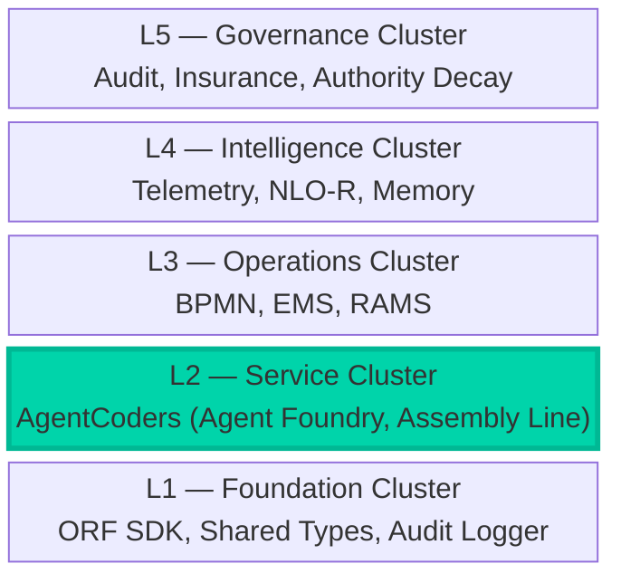

# Architecture Overview

AgentCoders uses a hierarchical multi-agent architecture where a CEO agent (Jarvis) orchestrates specialist agent pods that autonomously deliver software via Claude Code CLI.

## System Diagram

```
                         ┌──────────────┐
                         │   Human      │
                         │   (Telegram)  │
                         └──────┬───────┘
                                │
                         ┌──────▼───────┐
                         │   Telegram   │
                         │   Gateway    │
                         │  (Telegraf)  │
                         └──────┬───────┘
                                │ Redis Pub/Sub
                    ┌───────────┼───────────────┐
                    │           │               │
             ┌──────▼──────┐   │        ┌──────▼──────┐
             │   Jarvis    │   │        │   Tenant    │
             │   Runtime   │   │        │   Manager   │
             │  (CEO Agent)│   │        │  (REST API) │
             └──────┬──────┘   │        └─────────────┘
                    │          │
        ┌───────────┼──────────┼───────────┐
        │           │          │           │
   ┌────▼────┐ ┌────▼────┐ ┌──▼──────┐ ┌──▼──────┐
   │  Coder  │ │  Coder  │ │Reviewer │ │ Tester  │
   │  Agent  │ │  Agent  │ │  Agent  │ │  Agent  │
   │(Claude) │ │(Claude) │ │(Claude) │ │(Claude) │
   └────┬────┘ └────┬────┘ └────┬────┘ └────┬────┘
        │           │           │           │
   ┌────▼───────────▼───────────▼───────────▼────┐
   │              Shared Layer                    │
   │  (Drizzle ORM, Redis, Types, Utils)         │
   └────┬──────────────────────────┬─────────────┘
        │                          │
   ┌────▼────┐              ┌─────▼─────┐
   │PostgreSQL│              │   Redis    │
   │  (25     │              │ (Pub/Sub   │
   │  tables) │              │  23 chan)  │
   └─────────┘              └───────────┘
        │
   ┌────▼──────────────────────────────────────┐
   │              Platform Services             │
   ├────────────┬────────────┬─────────────────┤
   │  Billing   │ Governance │   Dashboard     │
   │  Service   │ (Audit,    │   (React+Vite   │
   │  (DWI,     │  Telemetry,│    10 pages)    │
   │   Stripe)  │  Insurance)│                 │
   └────────────┴────────────┴─────────────────┘
```

## Data Flow

### Work Item Lifecycle

```
ADO/GitHub Work Item
    │
    ▼
Jarvis polls ADO ──► GSD Planner decomposes epic
    │                     │
    ▼                     ▼
Task Decomposer ──► Creates child work items in ADO
    │
    ▼
Squad Manager assigns to idle agent
    │
    ▼
Agent Pod claims work item
    │
    ├──► Git: create branch
    ├──► FreshContextExecutor: write .claude/TASK.md
    ├──► Claude Code CLI: code the solution
    ├──► PR Manager: create pull request
    ├──► Redis: publish progress updates
    │
    ▼
Reviewer Agent reviews PR
    │
    ▼
CI Pipeline runs
    │
    ▼
Quality Gates verify (all 6 criteria)
    │
    ├── Pass ──► DWI marked billable ──► Stripe invoice
    └── Fail ──► Auto-revert within 30min window
```

### Message Flow (Redis Pub/Sub)

All channels are prefixed with `{tenantId}:` for multi-tenant isolation:

- **Vertical channels** — Jarvis distributes work to agent pods per vertical
- **Heartbeat channel** — Agents report status every poll interval
- **Progress channels** — Per-agent progress updates
- **Telegram channels** — Inbound commands, outbound notifications, approval decisions
- **DWI lifecycle channels** — Work item created/PR linked/CI completed/approved/merged/closed
- **Governance channels** — Audit events, telemetry metrics, failure alerts
- **Budget channels** — Budget warnings and hard stops

## AINEFF Ecosystem Connection

AgentCoders is the **L2 — Service Cluster** implementation within the AINEFF 5-layer protocol stack. It provides the autonomous agent workforce that AINEFF orchestrates.

### System Mapping

| AINEFF System | AgentCoders Package | Function |
|--------------|-------------------|----------|
| System 15: Agent Foundry | `agent-runtime` | Instantiate and equip specialist agents |
| System 17: Assembly Line Orchestration | `jarvis-runtime` | Sequential/parallel task delegation |
| System 18: Cost Tracking | `billing-service`, `model-router` | DWI lifecycle, token cost metering |
| System 19: Quality Gates | `enhancement-layer`, `governance` | Security scanning, audit trail |
| System 20: Memory & Context | `agent-memory` | Working/long-term/episodic memory |
| System 21: SCM Integration | `scm-adapters` | GitHub/ADO adapters for PRs and work items |

### Specialist Role and AINEOUT Team Mapping

| AgentCoders Role | AINEOUT Equivalent | Key Responsibility |
|-----------------|-------------------|-------------------|
| `researcher` | Strategic Analyst | Analyze objectives, identify key artifacts |
| `architect` | System Designer | Design structure, plan file layout |
| `coder` | Implementation Agent | Generate code, commit to SCM |
| `tester` | Quality Agent | Validate output, run checks |
| `reviewer` | Governance Agent | Review, approve, record experience |

### ORF Protocol Constraints

AgentCoders operations follow the ORF (Obligation-Responsibility-Finality) protocol at the transport layer. When JarvisCEO delegates a step:

1. The `PlanStep` is an **Obligation** issued by Jarvis to a specialist
2. The specialist **accepts Responsibility** by executing its tools
3. The `TaskOutcome` represents **Finality** — completed or failed, cryptographically auditable

This ensures every unit of work has a traceable lifecycle with no silent failures.

### Protocol Stack Position



For full AINEFF architecture details, see the [AINEFF Docs](https://andrew-leo-2024.github.io/aineff-docs/docs/architecture/overview).

## Package Dependency Graph

```
@agentcoders/shared (types, DB, utils, constants)
    ├── @agentcoders/agent-runtime
    │       └── uses: shared, Claude Code CLI, ADO API, git
    ├── @agentcoders/jarvis-runtime
    │       └── uses: shared, agent-runtime (types), kubectl
    ├── @agentcoders/telegram-gateway
    │       └── uses: shared, Telegraf
    ├── @agentcoders/billing-service
    │       └── uses: shared, Stripe SDK
    ├── @agentcoders/tenant-manager
    │       └── uses: shared, kubectl
    ├── @agentcoders/model-router
    │       └── uses: shared, Anthropic/OpenAI/Google/Ollama SDKs
    ├── @agentcoders/enhancement-layer
    │       └── uses: shared
    ├── @agentcoders/governance
    │       └── uses: shared
    ├── @agentcoders/agent-memory
    │       └── uses: shared
    ├── @agentcoders/skill-registry
    │       └── uses: shared, Drizzle
    ├── @agentcoders/management-models
    │       └── uses: shared
    ├── @agentcoders/scm-adapters
    │       └── uses: shared, Octokit
    └── @agentcoders/dashboard
            └── uses: React, Vite (API calls to tenant-manager)
```
