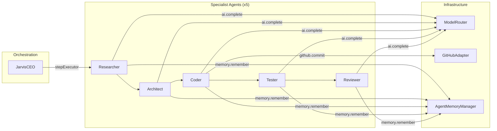

# E2E Integration Pipeline

The E2E integration test wires all 6 AgentCoders packages into a single pipeline, proving that JarvisCEO can orchestrate real specialist Agent instances through to live GitHub commits.

## Pipeline Architecture



## How It Works

### The `stepExecutor` Callback

JarvisCEO plans objectives into a sequence of `PlanStep` items, each assigned to a `SpecialistRole`. When a `stepExecutor` callback is provided in `JarvisConfig`, Jarvis delegates each step to the callback instead of using its internal simulation:

```typescript
stepExecutor: async (step: PlanStep, agentId: string): Promise<TaskOutcome> => {
  const agent = agents.get(step.assignTo);
  // Each specialist executes role-specific tools via the Agent instance
  const result = await agent.executeTool('ai.complete', { prompt: step.description });
  return { stepId: step.stepId, agentId, status: 'completed', output: result, durationMs: elapsed };
}
```

This bridges the JarvisCEO orchestrator to real `Agent` instances, each equipped with registered tools.

### The 5-Step Sequential Plan

Every objective follows the same specialist pipeline:

| Step | Role | Tools Used | What It Does |
|------|------|-----------|--------------|
| 1 | **Researcher** | `ai.complete`, `memory.remember` | Analyzes the objective, identifies key types and files |
| 2 | **Architect** | `ai.complete`, `memory.remember` | Recalls research, designs file structure |
| 3 | **Coder** | `ai.complete`, `github.commit`, `memory.remember` | Generates code and commits to GitHub |
| 4 | **Tester** | `ai.complete`, `memory.remember` | Validates the committed code |
| 5 | **Reviewer** | `ai.complete`, `memory.remember` | Reviews and approves; records experience as an episode |

### 6 Packages Wired Together

| Package | Role in Pipeline |
|---------|-----------------|
| `@agentcoders/jarvis-runtime` | Orchestration — plans objectives, delegates steps |
| `@agentcoders/agent-runtime` | Execution — Agent instances with registered tools |
| `@agentcoders/model-router` | AI — routes `ai.complete` calls to provider (mock or live) |
| `@agentcoders/scm-adapters` | SCM — `GitHubAdapter` creates branches, commits files |
| `@agentcoders/agent-memory` | Memory — `AgentMemoryManager` stores/recalls context per agent |
| `@agentcoders/shared` | Glue — shared types, config schemas, host for the test script |

## Mock vs Live Mode

| Mode | Flag | AI Provider | Commits | Speed |
|------|------|------------|---------|-------|
| **Mock** (default) | _(none)_ | `MockProvider` with canned responses per role | Real GitHub commits | ~2s |
| **Live** | `--live` | Anthropic Claude Sonnet via ModelRouter | Real GitHub commits | ~30s+ |

Mock mode uses deterministic canned responses so CI can run without API keys. Live mode calls the real Anthropic API.

## Running the Test

```bash
# Mock mode — no API key needed, real GitHub commits
GITHUB_TOKEN=$(gh auth token) npx tsx packages/shared/src/e2e-test.ts

# Live mode — requires Anthropic API key, real AI responses
GITHUB_TOKEN=$(gh auth token) \
  ANTHROPIC_API_KEY=sk-... \
  npx tsx packages/shared/src/e2e-test.ts --live
```

### Output

The test prints a structured report:

```
========================================================================
  AgentCoders E2E Integration Test
  Mode: MOCK (canned responses)
  Target: frankmax-com/agentcoders branch=agentcoders-e2e-test
========================================================================

[1/6] Initializing ModelRouter...
[2/6] Initializing GitHubAdapter...
[3/6] Initializing AgentMemoryManagers...
[4/6] Creating 5 specialist Agents with tools...
[5/6] Creating JarvisCEO with stepExecutor...
[6/6] Submitting objective to JarvisCEO...

  [PASS] researcher: Analyze objective (12ms)
  [PASS] architect: Design file structure (8ms)
  [PASS] coder: Generate and commit code (245ms)
  [PASS] tester: Validate committed code (6ms)
  [PASS] reviewer: Review implementation (9ms)

  Cost Tracking:
    Total:  $0.001234

  E2E TEST PASSED — All 5 steps completed, commit pushed to GitHub
========================================================================
```

## What It Proves

1. **Orchestration** — JarvisCEO decomposes objectives into steps and delegates via `stepExecutor`
2. **Tool execution** — Agent instances execute registered tools (`ai.complete`, `github.commit`, `memory.remember`)
3. **Real commits** — GitHubAdapter pushes actual commits to a GitHub repository
4. **Memory persistence** — Each specialist stores and recalls context across steps
5. **Cost tracking** — ModelRouter tracks token usage and cost per provider call

## AINEFF Ecosystem Connection

The E2E integration validates two AINEFF systems:

- **System 15: Agent Foundry** — specialist agents are instantiated, equipped with tools, and managed as autonomous units
- **System 17: Assembly Line Orchestration** — JarvisCEO orchestrates a sequential pipeline with dependency-aware delegation

The `stepExecutor` pattern maps to the ORF protocol's delegation model: JarvisCEO issues an **obligation** (the PlanStep), the specialist **accepts responsibility** (tool execution), and the TaskOutcome represents **finality** (completed or failed).
