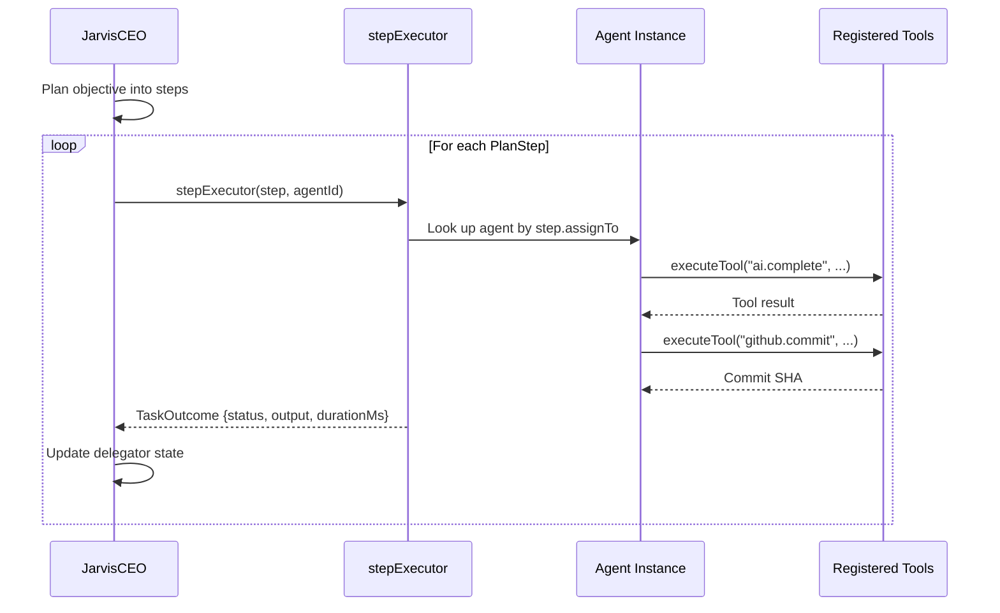

# @agentcoders/jarvis-runtime

Jarvis CEO agent runtime. Orchestrates specialist agent pods, decomposes tasks, manages squads, handles escalations, resolves conflicts, and generates daily summaries.

**Entry point:** `dist/jarvis.js`
**Source files:** 12

## Components

### Jarvis (`jarvis.ts`)

Main orchestrator class (331 lines):

1. Initializes Redis pub/sub for message routing
2. Subscribes to channels: heartbeat, escalation, cross-vertical, Telegram inbound
3. Schedules daily summary generation
4. Coordinates all sub-components
5. Handles graceful shutdown

**Subscribed channels:**
- `{tenantId}:agent:heartbeat` — agent status monitoring
- `{tenantId}:vertical:escalations` — escalation handling
- `{tenantId}:cross-vertical:new-request` — cross-vertical work
- `{tenantId}:telegram:jarvis` — direct human commands
- `{tenantId}:telegram:jarvis-{vertical}` — per-vertical commands

### GsdPlanner (`gsd-planner.ts`)

**Get Shit Done (GSD)** planning pattern for epic decomposition:

```typescript
interface GsdSpec {
  milestones: GsdMilestone[];
}

interface GsdMilestone {
  title: string;
  tasks: GsdTask[];
}

interface GsdTask {
  title: string;
  description: string;
  complexity: ComplexityTier;
}
```

**Behavior:**
- `analyzeProject(description)` — decomposes epic text into milestones and tasks
- `extractSections()` — parses markdown headers (##, #) into sections
- `decomposeMilestone()` — breaks sections into bullet-point tasks
- `estimateComplexity()` — heuristic complexity estimation per task

### TaskDecomposer (`task-decomposer.ts`)

Converts GSD plans into Azure DevOps work items:

- `decompose(workItem)` — breaks a parent work item into sub-tasks
- `analyzeAndDecompose()` — calls Claude Haiku CLI to generate sub-task JSON
- Creates child work items in ADO with:
  - Complexity tier estimation
  - Priority mapping (complexity → priority)
  - Parent-child linking
- Uses `callClaude()` — spawns `claude` CLI process with a decomposition prompt

### SquadManager (`squad-manager.ts`)

Tracks agent pod lifecycle and load-balances work:

- `handleHeartbeat(msg)` — updates agent status from heartbeat messages
- `assignWorkItem(workItemId, vertical)` — assigns work to idle agents via Redis
- `getIdleAgents()` / `getWorkingAgents()` — query agent states
- `getStuckAgents()` — detects agents without heartbeats (>2x poll interval)
- `reassignWork()` — moves work from stuck agents to healthy ones
- `getStats()` — returns metrics for daily summary

### EscalationHandler (`escalation-handler.ts`)

Handles 6 types of escalations with automatic resolution strategies:

| Escalation Type | Resolution Strategy |
|----------------|-------------------|
| `merge-conflict` | Reassign to different agent |
| `test-failure` | Retry with test output as feedback |
| `timeout` | Upgrade complexity tier (XS→S→M→L→XL) |
| `budget-exceeded` | Notify human immediately via Telegram |
| `blocked` | Check for env/dependency issues, escalate to human |
| `quality-issue` | Escalate to human via Telegram |

Returns `EscalationResolution` with action: `reassigned`, `retried`, `reclassified`, `escalated-to-human`, or `deferred`.

### ConflictResolver (`conflict-resolver.ts`)

Detects and resolves file access conflicts between concurrent agents:

- `registerFileAccess(agentId, files)` — tracks which agent modifies which files
- `releaseFiles(agentId)` — cleans up when agent completes
- `resolveConflicts()` — priority-based winner selection when two agents touch the same file
- `notifyBackOff(agentId)` — sends Redis message to the losing agent to back off
- `getActiveConflicts()` — lists current file conflicts
- `getStats()` — tracks total file count and active conflicts

### AgentSpawner (`agent-spawner.ts`)

Manages Kubernetes agent deployments:

- `spawnAgent(config)` — creates K8s Deployment manifest via `kubectl apply`
- `scaleAgents(vertical, replicas)` — scales deployment replicas
- `removeAgent(agentId)` — deletes agent deployments
- `listAgents()` — queries K8s for all agent pods
- Uses `spawn()` with pipe stdio for kubectl execution

### ContextManager (`context-manager.ts`)

Manages Jarvis planning context:

- `initializePlanning()` — creates `.planning` directory with config
- `loadPlanningConfig()` — reads planning state from disk
- `updateProgress(completed, pending)` — tracks milestone completion
- `checkContextRot()` — detects context window exhaustion (completion ratio > threshold triggers context rotation)

### DailySummary (`daily-summary.ts`)

Generates comprehensive daily metrics and sends via Telegram (309 lines):

- `generate()` — aggregates all stats using Drizzle ORM queries
- `generateAndSend()` — generates and publishes to Telegram outbound channel
- `formatTelegramMessage()` — HTML-formatted summary covering:

| Section | Metrics |
|---------|---------|
| Work Items | Completed, in progress, failed |
| Pull Requests | Created, merged |
| Escalations | Total, resolved |
| Cost | API spend, sessions, tokens |
| Revenue/DWI | Billable DWIs, revenue, margin |
| Agent Stats | Total, idle, working, stuck, offline |

### Pluggable Step Execution

JarvisCEO supports a `stepExecutor` callback in `JarvisConfig` that delegates plan steps to real Agent instances instead of using the built-in simulation:

```typescript
interface JarvisConfig {
  // ...existing fields...
  /** Optional callback to execute a plan step via a real agent instead of simulation. */
  stepExecutor?: (step: PlanStep, agentId: string) => Promise<TaskOutcome>;
}
```

When `stepExecutor` is provided, Jarvis calls it for each step during `executeObjective()`. The callback receives the `PlanStep` (with role, description, and dependencies) and the assigned `agentId`. It returns a `TaskOutcome` indicating success or failure.



**Example: Wiring Agents to JarvisCEO**

```typescript
const jarvis = new JarvisCEO({
  jarvisId: 'jarvis-prod',
  name: 'Jarvis',
  model: { provider: 'anthropic', modelId: 'claude-sonnet-4-20250514' },
  delegationStrategy: 'sequential',
  maxSpecialists: 10,
  reviewBeforeComplete: false,
  escalateOnFailure: true,

  stepExecutor: async (step, agentId) => {
    const agent = agents.get(step.assignTo);
    const result = await agent.executeTool('ai.complete', {
      prompt: step.description,
    });
    return {
      stepId: step.stepId,
      agentId,
      status: 'completed',
      output: { content: result.content },
      durationMs: result.latencyMs,
    };
  },
});
```

See the [E2E Integration page](/infrastructure/e2e-integration) for a full working example that wires 5 specialist agents through JarvisCEO with real GitHub commits.

### AdoShim (`ado-shim.ts`)

Lightweight Azure DevOps REST client for Jarvis:

- `queryWorkItems(wiql)` — WIQL query
- `getWorkItem(id)` — fetch single work item
- `createWorkItem(type, fields)` — create with JSON-patch operations
- `updateWorkItem(id, fields)` — patch work item
- `addComment(workItemId, text)` — comment on work item
- Uses `retry()` for 429/5xx errors, Basic auth via PAT
