# @agentcoders/enhancement-layer

The Enhancement Layer is the **control system** wrapping probabilistic AI cognition. It converts stochastic token prediction into accountable, enterprise-grade output through a pipeline of 10 superclasses containing 30+ discrete stages.

The core insight: **models become commodities; the enhancement layer is the moat.** No model can save poorly-disciplined output. Any model becomes enterprise-ready when properly wrapped.

> Think of it as the "body" around the AI "brain" — sensory organs, immune system, nervous system, and skeletal structure that make raw intelligence useful.

**Entry point:** `dist/pipeline.js`
**Source files:** 23

## 10-Superclass Architecture

```mermaid
graph TB
    subgraph "Input"
        H[Human / System Prompt]
    end

    subgraph "Layer 1 — Amplification"
        A1[RAG Injector]
        A2[Chain of Verification]
        A3[Ensemble Router]
        A4[Domain Expert Prompts]
        A5[Output Refinement Loop]
    end

    subgraph "Layer 2 — Stabilization"
        S1[Schema Enforcer]
        S2[Deterministic Validator]
        S3[Confidence Scorer]
        S4[Temperature Controller]
        S5[Retry Escalator]
    end

    subgraph "Layer 3 — Translation"
        C1[Prompt Compiler]
        C2[Context Compressor]
        C3[Output Normalizer]
        C4[Code Formatter]
        C5[Semantic Deduplicator]
    end

    subgraph "Layer 4 — Governance"
        G1[Security Scanner]
        G2[PII Detector]
        G3[License Checker]
        G4[Cost Limiter]
        G5[Human Escalation Gate]
    end

    subgraph "Layer 5 — Economic Control"
        E1[Token Budget Manager]
        E2[Model Cost Router]
        E3[Session Cap Enforcer]
        E4[Task Tier Classifier]
    end

    subgraph "Layer 6 — Observability"
        O1[Prompt Audit Logger]
        O2[Decision Path Recorder]
        O3[Validation Result Store]
        O4[Traceability Reporter]
    end

    subgraph "Layer 7 — Orchestration"
        R1[Task Decomposer]
        R2[Tool Chain Manager]
        R3[Agent Coordinator]
        R4[State Persistence]
    end

    subgraph "Layer 8 — Actuation"
        T1[API Gateway Bindings]
        T2[Workflow Engine Interface]
        T3[Tool Registry]
        T4[Transactional Safeguards]
    end

    subgraph "Layer 9 — Adaptation"
        D1[Error Feedback Loop]
        D2[Human Review Signals]
        D3[Prompt Tuner]
        D4[Performance Benchmarker]
    end

    subgraph "Layer 10 — Experience"
        X1[Voice Interface]
        X2[Visual Diff Renderer]
        X3[Accessibility Adapter]
        X4[Version Manager]
    end

    H --> A1
    A5 --> S1
    S5 --> C1
    C5 --> G1
    G5 --> E1
    E4 --> O1
    O4 --> R1
    R4 --> T1
    T4 --> D1
    D4 --> X1
    X4 --> Output[Enhanced Output]
```



## Core Architecture

### Stage Interface (`stage-interface.ts`)

```typescript
interface EnhancementStage {
  name: string;
  type: 'amplifier' | 'stabilizer' | 'codec' | 'armour'
    | 'economic' | 'observability' | 'orchestration'
    | 'actuation' | 'adaptation' | 'experience';
  execute(input: string, context: StageContext): Promise<StageOutput>;
}

interface StageContext {
  tenantId: string;
  agentId: string;
  workItemId?: number;
  metadata: Record<string, unknown>;
}

interface StageOutput {
  content: string;
  modified: boolean;
  details: Record<string, unknown>;
}
```

### EnhancementPipeline (`pipeline.ts`)

Executes stages sequentially, tracking timing and results:

```typescript
interface EnhancementResult {
  originalInput: string;
  enhancedOutput: string;
  stages: StageResult[];       // per-stage name, status, score, durationMs
  totalDurationMs: number;
  finalScore: number;
}
```

- Graceful failure handling — a failing stage doesn't abort the pipeline
- Per-stage timing recorded in milliseconds
- Results stored in `enhancementRuns` database table

### PipelineBuilder (`pipeline-builder.ts`)

Fluent API for composing pipelines:

```typescript
const pipeline = new PipelineBuilder()
  .addAmplifier(new RagInjector())
  .addStabilizer(new SchemaEnforcer())
  .addCodec(new PromptCompiler())
  .addArmour(new SecurityScanner())
  .addEconomic(new TokenBudgetManager())
  .addObservability(new PromptAuditLogger())
  .addOrchestration(new TaskDecomposer())
  .addActuation(new ApiGatewayBindings())
  .addAdaptation(new ErrorFeedbackLoop())
  .addExperience(new VisualDiffRenderer())
  .build();
```

---

## Layer 1 — Amplifiers (Boost Quality)

### 1. RAG Injector (`amplifiers/rag-injector.ts`)

Retrieves relevant context chunks to augment prompts:
- Maximum **5 chunks** per injection
- Relevance **threshold: 0.7** — only chunks above this score are included
- Sources: agent memory, project files, documentation

### 2. Chain of Verification (`amplifiers/chain-of-verification.ts`)

Verifies claims in generated content across **4 verification types:**
- `factual` — fact-checking assertions
- `code-correctness` — syntax and logic verification
- `dependency` — import and package validation
- `api-usage` — API call correctness

### 3. Ensemble Router (`amplifiers/ensemble-router.ts`)

Selects the best model combination by analyzing task profile:
- Routes code generation to specialized models
- Can split tasks across multiple models for ensemble results
- Considers task type, complexity, and domain

### 4. Domain Expert Prompts (`amplifiers/domain-expert-prompts.ts`)

Injects domain-specific expertise into prompts. **6 domains:**
- `fintech` — financial regulations, PCI compliance, transaction handling
- `healthcare` — HIPAA, medical data handling, HL7/FHIR
- `ecommerce` — payment flows, inventory, cart management
- `saas` — multi-tenancy, subscription models, API design
- `devtools` — CLI patterns, plugin systems, developer experience
- `iot` — device protocols, edge computing, telemetry

### 5. Output Refinement Loop (`amplifiers/output-refinement-loop.ts`)

Iterative refinement of generated code through **3 refinement types:**
- `lint` — style and formatting checks
- `typecheck` — TypeScript type verification
- `test` — test execution and coverage

Maximum iterations controlled by `MAX_REFINEMENT_LOOPS` (default: 3).

---

## Layer 2 — Stabilizers (Ensure Consistency)

### 1. Schema Enforcer (`stabilizers/schema-enforcer.ts`)

JSON schema validation with **auto-fix capability:**
- Validates output against expected schema
- Attempts automatic correction of common schema violations
- Reports validation errors when auto-fix fails

### 2. Deterministic Validator (`stabilizers/deterministic-validator.ts`)

AST-based code analysis:
- **AST parsing** — verifies code is syntactically valid
- **Import checking** — validates all imports resolve to real packages
- Catches undefined references and missing dependencies

### 3. Confidence Scorer (`stabilizers/confidence-scorer.ts`)

Scores output quality across **6 signals:**

| Signal | What It Measures |
|--------|-----------------|
| `length` | Output completeness relative to task complexity |
| `code-structure` | Proper function/class/module structure |
| `completeness` | All requirements addressed |
| `hedging` | Absence of uncertain language ("maybe", "might") |
| `error-handling` | Try/catch, error boundaries, edge cases |
| `documentation` | Inline comments where needed |

Minimum threshold controlled by `CONFIDENCE_THRESHOLD` (default: 0.7).

### 4. Temperature Controller (`stabilizers/temperature-controller.ts`)

Dynamically adjusts model temperature based on task requirements:
- Lower temperature for deterministic tasks (bug fixes, refactors)
- Higher temperature for creative tasks (architecture, design)

### 5. Retry Escalator (`stabilizers/retry-escalator.ts`)

Escalates to more capable models on repeated failures:
- Tracks failure count per stage
- Upgrades model tier after threshold failures
- Prevents infinite retry loops

---

## Layer 3 — Translation / Codecs (Format Transformation)

### 1. Prompt Compiler (`codecs/prompt-compiler.ts`)

Compiles prompts for target model formats:

| Target | Format |
|--------|--------|
| Claude | XML tags (`<task>`, `<context>`, `<instructions>`) |
| GPT | JSON structured prompts |
| Gemini | Markdown with headers |
| LLaMA | `[INST]...[/INST]` instruction format |

### 2. Context Compressor (`codecs/context-compressor.ts`)

Reduces context size while preserving semantic meaning:
- Removes redundant information
- Summarizes verbose content
- Prioritizes most relevant context

### 3. Output Normalizer (`codecs/output-normalizer.ts`)

Standardizes output format across providers:
- Strips provider-specific formatting artifacts
- Normalizes code blocks, headers, and structure
- Ensures consistent output regardless of model used

### 4. Code Formatter (`codecs/code-formatter.ts`)

Applies consistent code formatting:
- Language-aware formatting rules
- Consistent indentation, spacing, and style
- Removes unnecessary whitespace

### 5. Semantic Deduplicator (`codecs/semantic-deduplicator.ts`)

Removes semantically duplicate content:
- Detects repeated explanations or code blocks
- Merges overlapping content
- Preserves unique information

---

## Layer 4 — Governance / Armours (Safety & Compliance)

### 1. Security Scanner (`armours/security-scanner.ts`)

Scans for security vulnerabilities — **70 detection patterns:**

| Category | Examples |
|----------|---------|
| XSS | `innerHTML`, `<script>` tags, `eval()` |
| SQL Injection | String concatenation in queries |
| Command Injection | Unsanitized `exec()`, `spawn()` calls |
| Secrets | API keys, AWS keys, private keys, passwords |

Configurable check selection — can enable/disable specific categories.

### 2. PII Detector (`armours/pii-detector.ts`)

Detects personally identifiable information:
- Email addresses, phone numbers, SSNs
- Names, addresses, dates of birth
- Financial information (credit card numbers)

### 3. License Checker (`armours/license-checker.ts`)

Open-source license compliance:
- Validates license compatibility
- Flags copyleft licenses in proprietary projects
- Checks attribution requirements

### 4. Cost Limiter (`armours/cost-limiter.ts`)

Per-enhancement cost ceiling enforcement:
- Controlled by `MAX_COST_PER_ENHANCEMENT_USD` (default: $5.00)
- Aborts pipeline if accumulated stage costs exceed limit
- Logs cost breakdown per stage

### 5. Human Escalation Gate (`armours/human-escalation-gate.ts`)

Routes high-risk outputs to human review:
- Triggers on security findings above threshold
- Triggers on low confidence scores
- Publishes escalation to Telegram for human decision
- Blocks pipeline until approved or rejected

---

## Layer 5 — Economic Control (Cost & Resource Management)

Controls the economic footprint of every AI operation. Without this layer, token costs grow linearly with usage and blow budgets silently.

### 1. Token Budget Manager (`economic/token-budget-manager.ts`)

Per-tenant, per-session token budgeting:
- Allocates token budgets by task priority tier
- Tracks cumulative consumption across pipeline stages
- Emits budget warnings at 70%, 90%, and 100% thresholds
- Supports burst allowances for high-priority tasks

### 2. Model Cost Router (`economic/model-cost-router.ts`)

Dynamic model selection based on cost/quality tradeoff:
- Routes simple tasks (formatting, classification) to cheaper models
- Routes complex tasks (architecture, debugging) to capable models
- Maintains cost-per-token lookup table per provider
- Supports tenant-specific routing overrides

### 3. Session Cap Enforcer (`economic/session-cap-enforcer.ts`)

Hard limits on per-session resource consumption:
- Maximum tokens per session (configurable per tenant tier)
- Maximum wall-clock time per enhancement run
- Maximum number of model calls per pipeline execution
- Graceful degradation: truncates context rather than failing

### 4. Task Tier Classifier (`economic/task-tier-classifier.ts`)

Classifies incoming tasks into cost tiers:

| Tier | Examples | Model Class | Budget |
|------|----------|-------------|--------|
| `trivial` | Formatting, renaming | Small/fast | $0.01 |
| `standard` | Bug fixes, CRUD | Mid-tier | $0.50 |
| `complex` | Architecture, refactoring | Flagship | $2.00 |
| `critical` | Security, compliance | Flagship + review | $5.00 |

---

## Layer 6 — Observability (Audit & Traceability)

Every AI decision must be reconstructable. This layer records the full decision chain for compliance, debugging, and improvement.

### 1. Prompt Audit Logger (`observability/prompt-audit-logger.ts`)

Records every prompt sent to and response received from models:
- Full prompt text (with sensitive data redacted by Layer 4)
- Model ID, temperature, and parameters used
- Response text and token counts
- Correlation IDs linking to work items and tenants

### 2. Decision Path Recorder (`observability/decision-path-recorder.ts`)

Traces the reasoning chain across pipeline stages:
- Which stages modified the output and why
- Branch decisions in ensemble routing
- Escalation triggers and their thresholds
- Queryable via decision path API

### 3. Validation Result Store (`observability/validation-result-store.ts`)

Persists all validation outcomes:
- Schema validation pass/fail with error details
- Security scan findings with severity levels
- Confidence scores per signal
- Historical trend data for quality monitoring

### 4. Traceability Reporter (`observability/traceability-reporter.ts`)

Generates compliance-ready audit reports:
- Per-work-item enhancement trace
- Cost breakdown by stage and model
- Time-series quality metrics
- Exportable to PDF, JSON, or compliance system formats

---

## Layer 7 — Orchestration (Multi-Agent Coordination)

Manages complex tasks that require decomposition across multiple agents or sequential tool operations.

### 1. Task Decomposer (`orchestration/task-decomposer.ts`)

Breaks complex work items into executable subtasks:
- Dependency graph generation between subtasks
- Parallel execution where dependencies allow
- Subtask result aggregation into final output
- Maximum decomposition depth: 3 levels

### 2. Tool Chain Manager (`orchestration/tool-chain-manager.ts`)

Sequences tool calls for multi-step operations:
- Manages tool call ordering and data flow
- Handles tool failures with fallback strategies
- Tracks tool call budgets (max 10 per enhancement)

### 3. Agent Coordinator (`orchestration/agent-coordinator.ts`)

Coordinates work across multiple agents:
- Publishes sub-tasks to agent queues via Redis
- Collects and merges results from parallel agents
- Handles agent timeout and reassignment
- Maintains conversation context across agent handoffs

### 4. State Persistence (`orchestration/state-persistence.ts`)

Persists pipeline state for long-running operations:
- Checkpoint/resume for pipelines exceeding timeout
- State serialization to Redis with configurable TTL
- Enables pipeline recovery after crashes or restarts

---

## Layer 8 — Actuation (External System Interfaces)

Bridges the gap between AI decisions and real-world system changes. Every external action goes through this layer.

### 1. API Gateway Bindings (`actuation/api-gateway-bindings.ts`)

Typed interfaces to external APIs:
- GitHub (PRs, issues, reviews, commits)
- Jira, Linear, Asana (work item management)
- Slack, Telegram (notifications and escalations)
- Cloud providers (AWS, GCP, Azure for infrastructure operations)

### 2. Workflow Engine Interface (`actuation/workflow-engine-interface.ts`)

Connects to BPMN workflow engines:
- Triggers workflow steps based on AI decisions
- Receives workflow state updates
- Supports human-in-the-loop workflow patterns

### 3. Tool Registry (`actuation/tool-registry.ts`)

Dynamic registry of available tools per tenant:
- Tool capability descriptions for model function-calling
- Permission model — tenants configure which tools agents can use
- Tool versioning and deprecation

### 4. Transactional Safeguards (`actuation/transactional-safeguards.ts`)

Prevents irreversible damage from AI-initiated actions:
- Dry-run mode for destructive operations
- Rollback support for reversible actions
- Confirmation gates for high-impact changes (deploy, delete, merge)
- Action audit trail linked to observability layer

---

## Layer 9 — Adaptation (Self-Improvement)

Closes the feedback loop so the pipeline improves with every execution. Without this layer, the system repeats the same mistakes.

### 1. Error Feedback Loop (`adaptation/error-feedback-loop.ts`)

Feeds pipeline failures back into prompt engineering:
- Categorizes errors by type (hallucination, format, logic, security)
- Generates anti-patterns database from recurring failures
- Adjusts stage parameters based on error frequency

### 2. Human Review Signals (`adaptation/human-review-signals.ts`)

Incorporates human feedback from escalation decisions:
- Tracks approval/rejection ratios by stage and task type
- Identifies stages with high rejection rates for tuning
- Feeds reviewer comments into prompt improvement pipeline

### 3. Prompt Tuner (`adaptation/prompt-tuner.ts`)

Automated prompt optimization based on outcome data:
- A/B tests prompt variations per stage
- Selects winning variants based on quality scores
- Supports tenant-specific prompt customization

### 4. Performance Benchmarker (`adaptation/performance-benchmarker.ts`)

Continuous benchmarking against quality baselines:
- Runs synthetic test suites per stage
- Detects quality regression across model updates
- Generates performance reports for tenant dashboards

---

## Layer 10 — Experience (Human Interface)

The interface between the enhancement pipeline and human users. Ensures AI output is consumable, reviewable, and actionable.

### 1. Voice Interface (`experience/voice-interface.ts`)

Audio interaction support:
- Speech-to-text for prompt input
- Text-to-speech for output narration
- Voice command shortcuts for common operations

### 2. Visual Diff Renderer (`experience/visual-diff-renderer.ts`)

Rich diff visualization for code changes:
- Side-by-side and inline diff views
- Syntax-highlighted change annotations
- Collapsible sections for large diffs

### 3. Accessibility Adapter (`experience/accessibility-adapter.ts`)

Ensures output meets accessibility standards:
- Screen reader compatible output formatting
- High-contrast mode for visual elements
- Keyboard navigation for interactive outputs

### 4. Version Manager (`experience/version-manager.ts`)

Output versioning and history:
- Tracks all versions of enhanced output per work item
- Supports rollback to previous enhancement versions
- Diff between versions for change review

---

## Design Philosophy

The Enhancement Layer embodies three principles:

**1. Quality Compounding** — Each layer's output feeds the next. Amplification improves what Stabilization validates. Governance catches what Translation might expose. Over thousands of executions, small per-stage improvements compound into massive quality differentials.

**2. Variance Suppression** — AI models are inherently stochastic. The same prompt can produce wildly different outputs. The Enhancement Layer's job is to narrow the output distribution — making the 95th percentile output nearly as good as the 5th percentile. Enterprises need predictability, not occasional brilliance.

**3. Liability Minimization** — Every layer adds an audit point. When something goes wrong (and it will), the observability and governance layers provide a complete chain of evidence showing what happened, why, and who approved it. This isn't just good engineering — it's a legal requirement for enterprise AI deployment.

### Second-Order Effects

Adding 10 layers of enhancement is not free:

| Concern | Mitigation |
|---------|------------|
| **Latency** | Parallel stage execution, stage skipping for low-risk tasks |
| **Cost compounding** | Economic Control layer enforces budgets before stages execute |
| **Governance overhead** | Configurable per-tenant — skip layers that don't apply |
| **Debugging complexity** | Observability layer makes every decision reconstructable |
| **Vendor lock-in** | Translation layer abstracts all model-specific interfaces |
